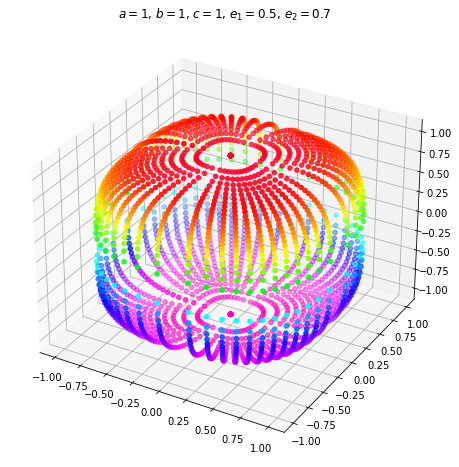

# superellipsoid_msgs

## Superellipsoid Definition

This message uses the following Superellipsoid implicit equation in https://doi.org/10.1109/ICRA.2016.7487394 as follows;

$$
f(x,y,z) = \left(\left|\frac{x}{a}\right|^{\frac{2}{e_2}} + \left|\frac{y}{b}\right|^{\frac{2}{e_2}} \right)^\frac{e_2}{e_1} + \left|\frac{z}{c}\right|^{\frac{2}{e_1}} = 1
$$

Another implicit equation is used in https://en.wikipedia.org/wiki/Superellipsoid with replacing e1 and e2:

$$
r = \frac{2}{e_2}
$$

$$
t = \frac{2}{e_1}
$$

$$
f(x,y,z) = \left( \left|\frac{x}{a}\right|^r + \left|\frac{y}{b}\right|^r  \right)^\frac{t}{r} + \left|\frac{z}{c}\right|^t = 1
$$

Volume is computed using the formula in https://en.wikipedia.org/wiki/Superellipsoid

$$
V = \frac{2}{3} abc \left(\frac{4}{rt}\right) \beta\left(\frac{1}{r},\frac{1}{r} \right) \beta\left(\frac{2}{t},\frac{1}{t} \right)
$$
